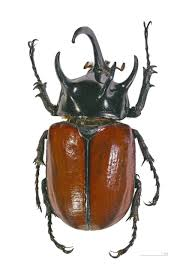

<div id="top"></div>

[![Contributors][contributors-shield]][contributors-url]
[![Forks][forks-shield]][forks-url]
[![Stargazers][stars-shield]][stars-url]
[![Issues][issues-shield]][issues-url]
[![MIT License][license-shield]][license-url]
[![LinkedIn][linkedin-shield]][linkedin-url]


<!-- PROJECT LOGO -->
<br />
<div align="center">
  <a href="https://github.com/ashusharmasigdev/Machfly">
    
  </a>

<h3 align="center">Machfly</h3>

  <p align="center">
    An Electronic Insect, Just Diving in Data Science and Hyper Intelligency, Wishing to become Scientist.
    <br />
    <a href="https://github.com/ashusharmasigdev/Machfly/tree/master/Docs"><strong>Explore the docs »</strong></a>
    <br />
    <br />
    <a href="https://github.com/ashusharmasigdev/Machfly/tree/master/Tests">View Tests</a>
    ·
    <a href="https://github.com/ashusharmasigdev/Machfly/issues">Report Bug</a>
    ·
    <a href="https://github.com/ashusharmasigdev/Machfly/issues">Request Feature</a>
  </p>
</div>


<!-- TABLE OF CONTENTS -->
<details>
  <summary>Table of Contents</summary>
  <ol>
    <li>
      <a href="#about-machfly">About Machfly</a>
      <ul>
        <li><a href="#built-in">Built In</a></li>
      </ul>
    </li>
    <li>
      <a href="#getting-started">Getting Started</a>
      <ul>
        <li><a href="#prerequisites">Prerequisites</a></li>
        <li><a href="#installation">Installation</a></li>
      </ul>
    </li>
    <li><a href="#usage">Usage</a></li>
    <li><a href="#roadmap">Roadmap</a></li>
    <li><a href="#contributing">Contributing</a></li>
    <li><a href="#license">License</a></li>
    <li><a href="#contact">Contact</a></li>
    <li><a href="#acknowledgments">Acknowledgments</a></li>
  </ol>
</details>


<!-- ABOUT THE PROJECT -->
## About Machfly

<!-- [![Product Name Screen Shot][product-screenshot]](https://example.com) -->

Machfly is a Bittle, Developing his own Wings to fly, It's real name is Mafli: `ashusharmasigdev`, `Machfly`, `@ashusharmadev`, `ashusharmasigmadev@gmail.com`, `Machfly`


### Built In

* Machfly Is Built with Modern ISO C++
* Compiled with G++
* Supports Makefile and Meson as Build System


<!-- GETTING STARTED -->
## Getting Started

Following is Instructions to use Machfly in your own Dream Projects!
<!-- 
### Prerequisites

This is an example of how to list things you need to use the software and how to install them.
* npm
  ```sh
  npm install npm@latest -g
  ```

### Installation

1. Get a free API Key at [https://example.com](https://example.com)
2. Clone the repo
   ```sh
   git clone https://github.com/github_username/repo_name.git
   ```
3. Install NPM packages
   ```sh
   npm install
   ```
4. Enter your API in `config.js`
   ```js
   const API_KEY = 'ENTER YOUR API';
   ``` -->

<p align="right">(<a href="#top">back to top</a>)</p>


<!-- CONTRIBUTING -->
## Contributing

Contributions are what make the open source community such an amazing place to learn, inspire, and create. Any contributions you make are **greatly appreciated**.

If you have a suggestion that would make this better, please fork the repo and create a pull request. You can also simply open an issue with the tag "enhancement".
Don't forget to give the project a star! Thanks again!

1. Fork the Project
2. Create your Feature Branch (`git checkout -b feature/AmazingFeature`)
3. Commit your Changes (`git commit -m 'Add some AmazingFeature'`)
4. Push to the Branch (`git push origin feature/AmazingFeature`)
5. Open a Pull Request

<p align="right">(<a href="#top">back to top</a>)</p>


<!-- LICENSE -->
## License

Distributed under the MIT License. See `LICENSE.txt` for more information.

<p align="right">(<a href="#top">back to top</a>)</p>


<!-- CONTACT -->
## Contact

Ashu Sharma - [@ashusharmadev](https://twitter.com/ashusharmadev) - ashusharmasigmadev@gmail.com

Project Link: [https://github.com/ashusharmasigdev/Machfly](https://github.com/ashusharmasigdev/Machfly)

<p align="right">(<a href="#top">back to top</a>)</p>